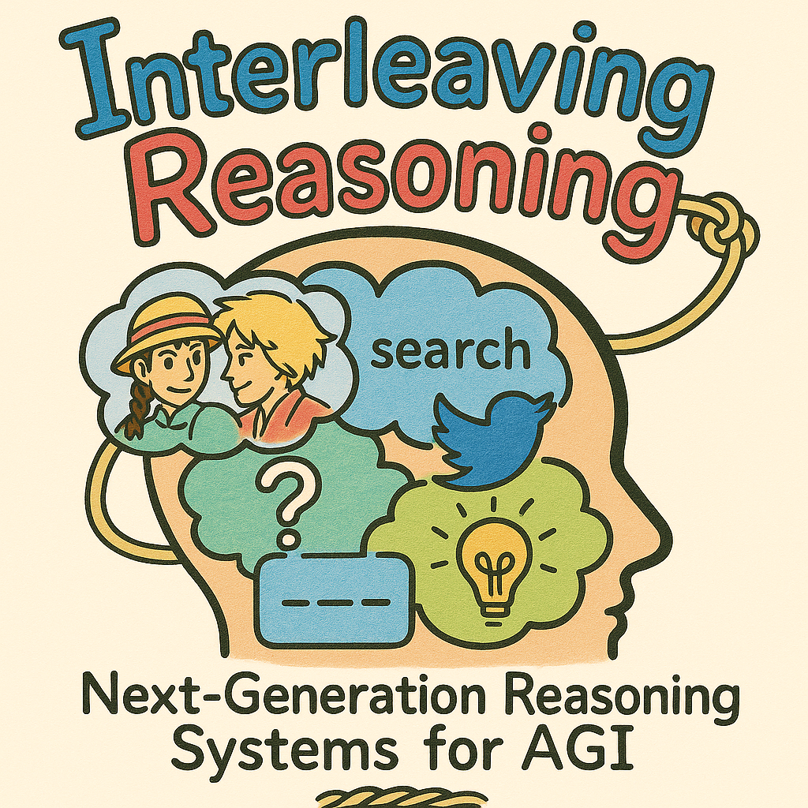
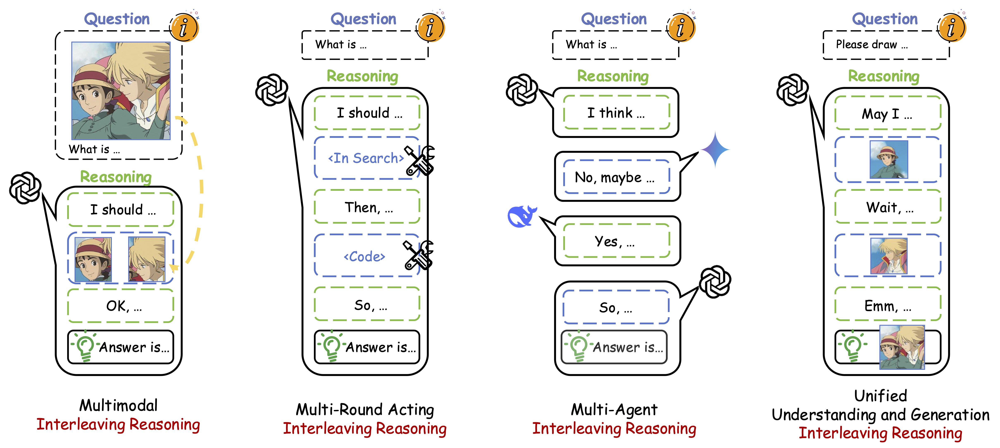
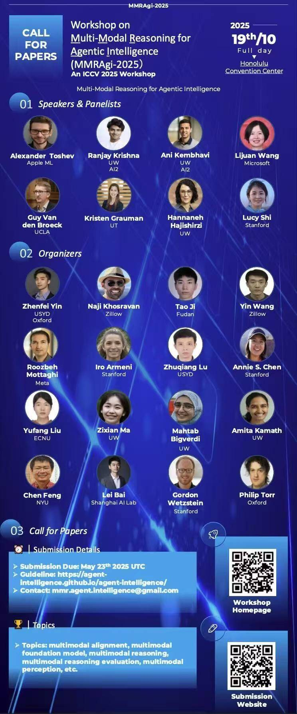
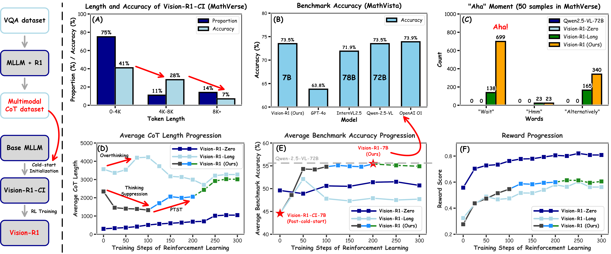
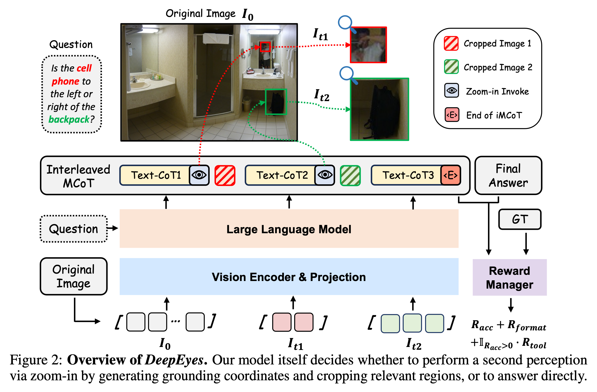

    

# Awesome Interleaving Reasoning

    

With the release of [OpenAI o1](https://openai.com/o1/) and [Deepseek-R1](https://arxiv.org/abs/2501.12948), reasoning models have yielded remarkably promising results and garnered significant attention from the research community. This development signals that reasoning models represent a critical advancement toward Artificial General Intelligence (AGI). The standard reasoning paradigm can be formally defined as:

- **Standard Reasoning**: The model conducts a comprehensive intermediate reasoning phase prior to generating the final response. This intermediate reasoning typically manifests as unstructured textual content, with the entire inference process constituting a single atomic operation.

Recently, the introduction of [OpenAI o3](https://openai.com/index/introducing-o3-and-o4-mini/), [Deep research](https://openai.com/index/introducing-deep-research/), [Zochi](https://github.com/IntologyAI/Zochi/blob/main/Zochi_Technical_Report.pdf), and [BAGEL](https://arxiv.org/abs/2505.14683) has established an alternative reasoning formulation, which we designate as **Interleaving Reasoning**. In contrast to standard reasoning, Interleaving Reasoning is characterized by multi-turn interactions and exhibits sophisticated reasoning dynamics. This reasoning modality has empirically demonstrated superior accuracy in addressing complex problems. Consequently, we posit that Interleaving Reasoning potentially constitutes the **Next-Generation Reasoning Systems for AGI**. We propose a taxonomy of Interleaving Reasoning that encompasses the following categories:

- **Multimodal Interleaving Reasoning**: The model's inference process operates on diverse information modalities (e.g., textual, visual, auditory, video). This involves an intricately interleaved execution of modality-specific information processing and cross-modal reasoning. Examples: [OpenAi o3](https://openai.com/index/introducing-o3-and-o4-mini/), [DeepEyes](https://arxiv.org/abs/2505.14362).
- **Multi-Round Acting Interleaving Reasoning**: The system achieves task completion through iterative interactions (actions) with the environment. Each action is either predicated upon or performed in conjunction with a reasoning-driven inference step, establishing an interleaved execution of action and inference processes. Examples: [Deep research](https://openai.com/index/introducing-deep-research/), [Search-R1](https://arxiv.org/abs/2503.09516), [ReTool](https://arxiv.org/abs/2504.11536), [UI-TARS](https://arxiv.org/abs/2501.12326), [ReAct](https://arxiv.org/abs/2210.03629).
- **Multi-Agent Interleaving Reasoning**: In a multi-agent system, multiple agents, such as LLMs and MLLMs, engage in collaborative or competitive dynamics via a paradigm of interleaved reasoning. This implies that agents either alternate in contributing discrete reasoning steps, share intermediate conclusions to establish a shared cognitive state, and subsequently build upon this foundation, or their respective inferential processes exhibit mutual influence. Examples: [Society of Minds](https://arxiv.org/abs/2305.14325), [Zochi](https://github.com/IntologyAI/Zochi/blob/main/Zochi_Technical_Report.pdf), [MetaGPT](https://arxiv.org/abs/2309.07870).
- **Unified Understanding and Generation Interleaving Reasoning**: The model's reasoning capabilities are not confined to producing solely unimodal outputs. Instead, it strategically generates multimodal content (e.g., textual and visual elements) as an integral intermediate step within its intrinsic processes of comprehension and problem-solving. Example: [GoT](https://arxiv.org/abs/2503.10639), [T2I-R1](https://arxiv.org/abs/2505.00703), [BAGEL](https://arxiv.org/abs/2505.14683).

> It is imperative to establish precise categorical boundaries:
>
> - While **Multimodal Interleaving Reasoning** could conceivably be subsumed within the **Multi-Round Acting Interleaving Reasoning** paradigm, we formally define Multimodal Interleaving Reasoning as necessitating the direct incorporation of multi-modal information streams during the reasoning process. This information typically derives from the processing of input modalities, as exemplified by [OpenAi o3](https://openai.com/index/introducing-o3-and-o4-mini/), which extracts visual information and integrates it into text-based reasoning workflows.
> - The fundamental distinction between **Multi-Round Acting Interleaving Reasoning** and **Multi-Agent Interleaving Reasoning** lies in their architectural composition: Multi-Round Acting Interleaving Reasoning typically employs a single LLM/MLLM to perform reasoning and determine subsequent actions. Conversely, Multi-Agent Interleaving Reasoning leverages multiple LLM/MLLM entities that collaboratively contribute to reasoning steps.
> - The differentiation between **Unified Understanding and Generation Interleaving Reasoning** and **Multimodal Interleaving Reasoning** resides in their information processing mechanisms. Unified Understanding and Generation Interleaving Reasoning utilizes an unified understanding and generation model capable of directly generating multimodal outputs during the reasoning process. In contrast, Multimodal Interleaving Reasoning typically sources its multimodal information from external systems or processes.

We aim to provide the community with a comprehensive and timely synthesis of this fascinating and promising field, as well as some insights into it. This repository provides valuable reference for researchers in the field of Interleaving Reasoning, please start your exploration! 

***This work is in progress!***

---

<b> Table of Contents </b> 

- [Our Group](#our-group)
  - [Originators](#originators)
  - [Members](#members)
- [Our Activities](#our-activities)
- [Standard Reasoning Examples](#standard-reasoning-examples)
- [Awesome Interleaving Reasoning Papers](#awesome-interleaving-reasoning-papers)
  - [Multimodal Interleaving Reasoning](#multimodal-interleaving-reasoning)
  - [Multi-Round Acting Interleaving Reasoning](#multi-round-acting-interleaving-reasoning)
  	- [Search](#search)
  	- [Code](#code)
  	- [UI](#ui)
  	- [Complex acting](##complex-acting)
  	- [Others](#others)
  - [Multi-Agent Interleaving Reasoning](#multi-agent-interleaving-reasoning)
  	- [Debate](#debate)
  	- [Coordination](#coordination)
  - [Unified Understanding and Generation Interleaving Reasoning](#unified-understanding-and-generation-interleaving-reasoning)
  	- [Generation](#generation)
  	- [Understanding](#understanding) 	
- [Awesome Datasets](#awesome-datasets)

---

## Our Group

### Originators

  &nbsp;&nbsp;
  
  &nbsp;&nbsp;&nbsp;&nbsp;&nbsp;&nbsp;&nbsp;&nbsp;&nbsp;
  
   
  <a href="https://scholar.google.com/citations?user=6Ys6HgsAAAAJ&hl=en">
    <b>Wenxuan Huang</b>
  </a>
  &nbsp;&nbsp;&nbsp;&nbsp;&nbsp;&nbsp;&nbsp;&nbsp;
  <a href="https://scholar.google.com/citations?user=ngPR1dIAAAAJ&hl=en">
    <b>Zhenfei Yin</b>
  </a>
   
  &nbsp;&nbsp;
  ECNU&CUHK
  &nbsp;&nbsp;&nbsp;&nbsp;&nbsp;&nbsp;&nbsp;&nbsp;&nbsp;
  USYD&Oxford

### Members

## Our Activities

---

🔥🔥🔥 **Interleaving Reasoning Generation**  

    

 [[📖 arXiv Paper](https://arxiv.org/abs/2509.06945)] [[🌟 GitHub](https://github.com/Osilly/Interleaving-Reasoning-Generation)] 
  

 This is an early exploration to introduce Interleaving Reasoning to Text-to-image Generation field and achieve the SoTA benchmark performance. It also significantly improves the quality, fine-grained details and aesthetic aspects of generated images.  

---

🔥🔥🔥 **ICCV 2025 Workshop on Multi-Modal Reasoning for Agentic Intelligence (MMRAgi-2025)**  

    

We organised **[ICCV 2025 Workshop MMRAgi](https://agent-intelligence.github.io/agent-intelligence)**!   Submission DDL: Proceeding Track: 24 June 2025, 23:59 AoE, Non-Proceeding Track: 24 July 2025, 23:59 AoE.  

---

🔥🔥🔥 **Vision-R1: Incentivizing Reasoning Capability in Multimodal Large Language Models**  

    

 [[📖 arXiv Paper](https://arxiv.org/abs/2503.06749)] [[🌟 GitHub](https://github.com/Osilly/Vision-R1)] [[🤗 Vision-R1-cold Dataset](https://huggingface.co/datasets/Osilly/Vision-R1-cold)] [[🤗 Vision-R1-7B](https://huggingface.co/Osilly/Vision-R1-7B)]
  

 This is the first paper to explore how to effectively use RL for MLLMs and introduce Vision-R1, a reasoning MLLM that leverages cold-start initialization and RL training to incentivize reasoning capability.  

---

🔥🔥🔥 **DeepEyes: Incentivizing “Thinking with Images” via Reinforcement Learning**  

    

 [[📖 arXiv Paper](https://arxiv.org/abs/2505.14362)] [[🌟 GitHub](https://github.com/Visual-Agent/DeepEyes)] [[🤗 Dataset](https://huggingface.co/datasets/ChenShawn/DeepEyes-Datasets-47k)] [[🤗 DeepEyes-7B](https://huggingface.co/ChenShawn/DeepEyes-7B)]

 The first opensource "o3-like" interleaving reasoning MLLM with "Thinking with Images". They don’t just see an image, they can integrate visual information directly into the reasoning chain.  

## Standard Reasoning Examples

* [OpenAI o1] [Introducing OpenAI o1](https://openai.com/o1/)

* [DeepSeek-R1] [DeepSeek-R1: Incentivizing Reasoning Capability in LLMs via Reinforcement Learning](https://arxiv.org/abs/2501.12948) [[🤗Models](https://huggingface.co/deepseek-ai/DeepSeek-R1)] [[💻Code](https://github.com/deepseek-ai/DeepSeek-R1)]

* [Kimi-k1.5] [Kimi k1.5: Scaling Reinforcement Learning with LLMs](https://arxiv.org/abs/2501.12599) [[💻Code](https://github.com/MoonshotAI/Kimi-k1.5)]

* [QVQ-Max] [QVQ-Max: Think with Evidence](https://qwenlm.github.io/blog/qvq-max-preview/)

* [Vision-R1] [Vision-R1: Incentivizing Reasoning Capability in Multimodal Large Language Models](https://arxiv.org/abs/2501.12948) [[🤗Models](https://huggingface.co/Osilly/Vision-R1-7B)] [[🤗Datasets](https://huggingface.co/datasets/Osilly/Vision-R1-cold)] [[💻Code](https://github.com/Osilly/Vision-R1)]

## Awesome Interleaving Reasoning Papers

> ***PR Temporal***
>
> * [**RL**] [2505] [DeepEyes] [DeepEyes: Incentivizing "Thinking with Images" via Reinforcement Learning](https://arxiv.org/abs/2505.14362) [[🌐Project](https://visual-agent.github.io/)] [[🤗Models](https://huggingface.co/ChenShawn/DeepEyes-7B)] [[🤗Datasets](https://huggingface.co/datasets/ChenShawn/DeepEyes-Datasets-47k)] [[💻Code](https://github.com/Visual-Agent/DeepEyes)]
>
> *You can select your categories in [**Pretrain**, **SFT**, **RL**, **Prompt**, **Position paper**, **Survey paper**] and so on. Furthermore, you can combine them, for example,  **SFT+RL**.*

### Multimodal Interleaving Reasoning

> Definition: The model's inference process operates on diverse information modalities (e.g., textual, visual, auditory, video). This involves an intricately interleaved execution of modality-specific information processing and cross-modal reasoning.

* [**SFT**] [2506] [VGR] [VGR: Visual Grounded Reasoning](https://arxiv.org/abs/2506.11991)

* [**Position paper**] [2505] [Visual Thoughts: A Unified Perspective of Understanding Multimodal Chain-of-Thought](https://arxiv.org/abs/2505.15510) 

* [**SFT**] [2505] [ARGUS] [ARGUS: Vision-Centric Reasoning with Grounded Chain-of-Thought](https://arxiv.org/abs/2505.23766) [[🌐Project](https://yunzeman.github.io/argus/] 

* [**SFT+RL**] [2505] [CoF] [Chain-of-Focus: Adaptive Visual Search and Zooming for Multimodal Reasoning via RL](https://arxiv.org/abs/2505.15436) [[🌐Project](https://cof-reasoning.github.io/)] [[💻Code](https://github.com/xtong-zhang/Chain-of-Focus)] [[🤗Models](https://huggingface.co/collections/laolao77/visual-arft-682c601d0e35ac6470adfe9f)] [[🤗Datasets](https://huggingface.co/datasets/laolao77/MAT)]

* [**SFT+RL**] [2505] [Pixel Reasoner] [Pixel Reasoner: Incentivizing Pixel-Space Reasoning with Curiosity-Driven Reinforcement Learning](https://arxiv.org/abs/2505.15966) [[🌐Project](https://tiger-ai-lab.github.io/Pixel-Reasoner/)] [[💻Code](https://github.com/TIGER-AI-Lab/Pixel-Reasoner)] [[🤗Models](https://huggingface.co/TIGER-Lab/PixelReasoner-RL-v1)] [[🤗Datasets](https://huggingface.co/collections/TIGER-Lab/pixel-reasoner-682fe96ea946d10dda60d24e)]

* [**SFT+RL**] [2505] [V-Triune] [One RL to See Them All: Visual Triple Unified Reinforcement Learning](https://arxiv.org/abs/2505.18129) [[💻Code](https://github.com/MiniMax-AI/One-RL-to-See-Them-All)] [[🤗Models](https://huggingface.co/One-RL-to-See-Them-All)] [[🤗Datasets](https://huggingface.co/datasets/One-RL-to-See-Them-All/Orsta-Data-47k)]

* [**SFT+RL**] [2505] [ViGoRL] [Grounded Reinforcement Learning for Visual Reasoning](https://arxiv.org/abs/2505.23678) [[🌐Project](https://visually-grounded-rl.github.io/)]

* [**SFT+RL**] [2505] [VLM-R\3] [VLM-R\3: Region Recognition, Reasoning, and Refinement for Enhanced Multimodal Chain-of-Thought](https://arxiv.org/abs/2505.16192)

* [**RL**] [2505] [Ground-R1] [Ground-R1: Incentivizing Grounded Visual Reasoning via Reinforcement Learning](https://arxiv.org/abs/2505.20272)

* [**RL**] [2505] [GRIT] [GRIT: Teaching MLLMs to Think with Images](https://arxiv.org/pdf/2505.15436) [[🌐Project](https://grounded-reasoning.github.io/)] [[💻Code](https://github.com/eric-ai-lab/GRIT)] [[🤗Models](https://huggingface.co/yfan1997/GRIT-20-Qwen2.5-VL-3B)]

* [**SFT+RL**] [2505] [Visual-ARFT] [Visual Agentic Reinforcement Fine-Tuning](https://arxiv.org/pdf/2505.14246) [[💻Code](https://github.com/Liuziyu77/Visual-RFT/tree/main/Visual-ARFT)] [[🤗Models](https://huggingface.co/collections/laolao77/visual-arft-682c601d0e35ac6470adfe9f)] [[🤗Datasets](https://huggingface.co/datasets/laolao77/MAT)]

* [**Prompt**] [2505] [VAT] [Visual Abstract Thinking Empowers Multimodal Reasoning](https://arxiv.org/abs/2502.17422) [[💻Code](https://github.com/THUNLP-MT/VAT)]

* [**SFT**] [2505] [MathCoder-VL] [MathCoder-VL: Bridging Vision and Code for Enhanced Multimodal Mathematical Reasoning](https://arxiv.org/abs/2505.10557) [[💻Code](https://github.com/mathllm/MathCoder)] [[🤗Models](https://huggingface.co/collections/MathLLMs/mathcoder-vl-68263a5d0b71cac81b6568b4)] [[🤗Datasets](https://huggingface.co/datasets/MathLLM/MathCodeInstruct)]

* [**SFT**] [2505] [v1] [Don’t Look Only Once: Towards Multimodal Interactive Reasoning with Selective Visual Revisitation](https://arxiv.org/pdf/2505.18842) [[💻Code](https://github.com/jun297/v1)] [[🤗Models](https://huggingface.co/kjunh/v1-7B)]

* [**SFT+RL**] [2505] [OpenThinkIMG] [OpenThinkIMG: Learning to Think with Images via Visual Tool Reinforcement Learning](https://arxiv.org/abs/2505.08617) [[💻Code](https://github.com/zhaochen0110/OpenThinkIMG)]

* [**RL**] [2505] [DeepEyes] [DeepEyes: Incentivizing "Thinking with Images" via Reinforcement Learning](https://arxiv.org/abs/2505.14362) [[🌐Project](https://visual-agent.github.io/)]  [[🤗Models](https://huggingface.co/ChenShawn/DeepEyes-7B)]  [[🤗Datasets](https://huggingface.co/datasets/ChenShawn/DeepEyes-Datasets-47k)] [[💻Code](https://github.com/Visual-Agent/DeepEyes)]

* [2504] [OpenAI o3] [Introducing OpenAI o3 and o4-mini](https://openai.com/index/introducing-o3-and-o4-mini/)

* [**SFT**] [2503] [CoT-VLA] [CoT-VLA: Visual Chain-of-Thought Reasoning for Vision-Language-Action Models](https://arxiv.org/abs/2503.22020) [[🌐Project](https://cot-vla.github.io/)]

* [**SFT**] [2501] [MVoT] [Imagine while Reasoning in Space: Multimodal Visualization-of-Thought](https://arxiv.org/pdf/2501.07542) [[🌐Project](https://thegenerality.com/agi/)] [[💻Code](https://github.com/chengzu-li/MVoT)] [[🤗Models](https://huggingface.co/collections/deepcs233/viscot-65fe883e2a0cdd3c59fc5d63)] [[🤗Datasets](https://huggingface.co/datasets/deepcs233/Visual-CoT)]

* [**SFT**] [2501] [ReFocus] [ReFocus: Visual Editing as a Chain of Thought for Structured Image Understanding](https://arxiv.org/abs/2501.05452) [[🌐Project](https://zeyofu.github.io/ReFocus/)] [[💻Code](https://github.com/zeyofu/ReFocus_Code)] [[🤗Models](https://huggingface.co/Fiaa/ReFocus)] [[🤗Datasets](https://github.com/zeyofu/ReFocus_Code?tab=readme-ov-file#download-training-data)]

* [**SFT**] [2403] [Visual COT] [Visual CoT: Advancing Multi-Modal Language Models with a Comprehensive Dataset and Benchmark for Chain-of-Thought Reasoning](https://arxiv.org/abs/2403.16999) [[🌐Project](https://hao-shao.com/projects/viscot.html)] [[💻Code](https://github.com/deepcs233/Visual-CoT)] [[🤗Models](https://huggingface.co/collections/deepcs233/viscot-65fe883e2a0cdd3c59fc5d63)] [[🤗Datasets](https://huggingface.co/datasets/deepcs233/Visual-CoT)]

* [**Prompt**] [2406] [Sketchpad] [Visual Sketchpad: Sketching as a Visual Chain of Thought for Multimodal Language Models](https://arxiv.org/abs/2406.09403) [[🌐Project](https://visualsketchpad.github.io)] [[💻Code](https://github.com/Yushi-Hu/VisualSketchpad)]

* [**SFT**] [2312] [V\*] [V*: Guided Visual Search as a Core Mechanism in Multimodal LLMs](https://arxiv.org/abs/2312.14135) [[🌐Project](https://vstar-seal.github.io)] [[💻Code](https://github.com/penghao-wu/vstar)]

* [**Prompt**] [2211] [VISPROG] [Visual Programming: Compositional visual reasoning without training](https://arxiv.org/abs/2211.11559) [[🌐Project](https://prior.allenai.org/projects/visprog)] [[💻Code](https://github.com/allenai/visprog)]

### Multi-Round Acting Interleaving Reasoning

> Definition: The system achieves task completion through iterative interactions (actions) with the environment. Each action is either predicated upon or performed in conjunction with a reasoning-driven inference step, establishing an interleaved execution of action and inference processes.

#### Search

* [**RL**] [2506] [ReasoningSearch] [Reinforcement Fine-Tuning for Reasoning towards Multi-Step Multi-Source Search in Large Language Models](https://arxiv.org/pdf/2506.08352) [[💻Code](https://github.com/wentao0429/ReasoningSearch)]

* [**RL**] [2506] [R-Search] [R-Search: Empowering LLM Reasoning with Search via Multi-Reward Reinforcement Learning]([https://arxiv.org/pdf/2506.04185](https://arxiv.org/pdf/2506.04185)) [[💻Code](https://github.com/QingFei1/R-Search?tab=readme-ov-file)]  [[🤗Models](https://huggingface.co/collections/qingfei1/r-search-6838323c612e76702ed709e6)]

* [**RL**] [2505] [Search-R1] [An Empirical Study on Reinforcement Learning for Reasoning-Search Interleaved LLM Agents](https://arxiv.org/pdf/2505.15117) [[💻Code](https://github.com/PeterGriffinJin/Search-R1)]

* [**RL**] [2505] [InForage] [Scent of Knowledge: Optimizing Search-Enhanced Reasoning with Information Foraging](https://arxiv.org/pdf/2505.09316)

* [**RL**] [2505] [ManuSearch] [ManuSearch: Democratizing Deep Search in Large Language Models with a Transparent and Open Multi-Agent Framework](https://arxiv.org/pdf/2505.18105) [[💻Code](https://github.com/RUCAIBox/ManuSearch)]

* [**RL**] [2505] [O2-Searcher] [O2-Searcher: A Searching-based Agent Model for Open-Domain Open-Ended Question Answering](https://arxiv.org/pdf/2505.16582) [[💻Code](https://github.com/KnowledgeXLab/O2-Searcher)]

* [**RL**] [2505] [R3-RAG] [R3-RAG: Learning Step-by-Step Reasoning and Retrieval for LLMs via Reinforcement Learning](https://arxiv.org/pdf/2505.23794) [[💻Code](https://github.com/Yuan-Li-FNLP/R3-RAG)]

* [**SFT**] [2505] [SimpleDeepSearcher] [SimpleDeepSearcher: Deep Information Seeking via Web-Powered Reasoning Trajectory Synthesis](https://arxiv.org/pdf/2505.16834)[[💻Code](https://github.com/RUCAIBox/SimpleDeepSearcher)]  [[🤗Models](https://huggingface.co/RUC-AIBOX/Qwen-7B-SimpleDeepSearcher)] [[🤗Datasets](https://huggingface.co/datasets/RUC-AIBOX/0.8k-data-SimpleDeepSearcher)]

* [**SFT+RL**] [2505] [EvolveSearch] [EvolveSearch: An Iterative Self-Evolving Search Agent](https://arxiv.org/pdf/2505.15117) 

* [**RL**] [2505] [PANGU DEEPDIVER] [PANGU DEEPDIVER: ADAPTIVE SEARCH INTENSITY SCALING VIA OPEN-WEB REINFORCEMENT LEARNING](https://arxiv.org/pdf/2505.24332)

* [**RL**] [2505] [ZEROSEARCH] [ZEROSEARCH: Incentivize the Search Capability of LLMs without Searching](https://arxiv.org/pdf/2505.04588) [[🌐Project](https://alibaba-nlp.github.io/ZeroSearch/)]  [[💻Code](https://github.com/Alibaba-NLP/ZeroSearch)] [[🤗Datasets](https://huggingface.co/datasets/sunhaonlp/ZeroSearch_dataset)] [[🤗Models](https://huggingface.co/collections/sunhaonlp/zerosearch-policy-google-v1-681b4ce012b9b6899832f4d0)]

* [**SFT+RL**] [2505] [R1-Searcher++] [R1-Searcher++: Incentivizing the Dynamic Knowledge Acquisition of LLMs via Reinforcement Learning](https://arxiv.org/abs/2505.17005) [[💻Code](https://github.com/GAIR-NLP/DeepResearcher)]

* [**RL**] [2505] [AutoRefine] [Search and Refine During Think: Autonomous Retrieval-Augmented Reasoning of LLMs ](https://arxiv.org/pdf/2505.11277) [[💻Code](https://github.com/syr-cn/AutoRefine)] [[🤗Models](https://huggingface.co/yrshi/AutoRefine-Qwen2.5-3B-Base)]

* [**RL**] [2504] [DeepResearcher] [DeepResearcher: Scaling Deep Research via Reinforcement Learning in Real-world Environments](https://arxiv.org/pdf/2504.03160) [[💻Code](https://github.com/RUCAIBox/R1-Searcher-plus)]

* [**RL**] [2504] [WebThinker] [WebThinker: Empowering Large Reasoning Models with Deep Research Capability](https://arxiv.org/pdf/2504.21776) [[💻Code](https://github.com/RUC-NLPIR/WebThinker)] [[🤗Models](https://huggingface.co/lixiaoxi45/WebThinker-QwQ-32B)]

* [**RL**] [2503] [ReSearch] [ReSearch: Learning to Reason with Search for LLMs via Reinforcement Learning](https://arxiv.org/abs/2503.19470) [[🤗Models](https://huggingface.co/agentrl/ReSearch-Qwen-7B-Instruct)]  [[🤗Datasets](https://huggingface.co/datasets/agentrl/ReCall-data)] [[💻Code](https://github.com/Agent-RL/ReCall)]

* [**RL**] [2503] [R1-Searcher] [R1-Searcher: Incentivizing the Search Capability in LLMs via Reinforcement Learning](https://arxiv.org/abs/2503.05592) [[🤗Models](https://huggingface.co/XXsongLALA/Qwen-2.5-7B-base-RAG-RL)]  [[🤗Datasets](https://huggingface.co/datasets/XXsongLALA/RAG-RL-Hotpotqa-with-2wiki)] [[💻Code](https://github.com/RUCAIBox/R1-Searcher)]

* [**RL**] [2503] [Search-R1] [Search-R1: Training LLMs to Reason and Leverage Search Engines with Reinforcement Learning](https://arxiv.org/abs/2503.09516) [[💻Code](https://github.com/PeterGriffinJin/Search-R1)]

* [2502] [Deep research] [Introducing deep research](https://openai.com/index/introducing-deep-research/)

* [**Prompt**] [2501] [Search-o1] [Search-o1: Agentic Search-Enhanced Large Reasoning Models](https://arxiv.org/pdf/2501.05366) [[💻Code](https://github.com/sunnynexus/Search-o1)]

* [**RL**] [2112] [WebGPT] [WebGPT: Browser-assisted question-answering with human feedback](https://arxiv.org/abs/2112.09332) [[🤗Datasets](https://huggingface.co/datasets/openai/webgpt_comparisons)]

#### Code

* [**RL**] [2506] [Hint-Engineering] [CoRT: Code-integrated Reasoning within Thinking](https://arxiv.org/pdf/2506.09820)[[💻Code](https://github.com/ChengpengLi1003/CoRT)] [[🤗Models](https://huggingface.co/theshyustc/CoRT-Prompt-Hint-1.5B-RL)] 

* [**RL**] [2506] [CTM] [Computational Thinking Reasoning in Large Language Models](https://arxiv.org/pdf/2506.02658) 

* [**Prompt**] [2506] [AUTOMIND] [AUTOMIND: Adaptive Knowledgeable Agent for Automated Data Science](https://arxiv.org/pdf/2506.10974) [[💻Code](https://github.com/innovatingAI/AutoMind)] 

* [**SFT**] [2506] [KnowCoder-V2] [KnowCoder-V2: Deep Knowledge Analysis](https://arxiv.org/pdf/2506.06881) 

* [**RL**] [2505] [VTool-R1] [VTool-R1: VLMs Learn to Think with Images via Reinforcement Learning on Multimodal Tool Use](https://arxiv.org/pdf/2505.19255) [[💻Code](https://github.com/VTool-R1/VTool-R1)] 

* [**RL**] [2505] [Tool-Star] [Tool-Star: Empowering LLM-Brained Multi-Tool Reasoner via Reinforcement Learning](https://arxiv.org/pdf/2505.16410) [[💻Code](https://github.com/dongguanting/Tool-Star)] [[🤗Models](https://huggingface.co/dongguanting/Tool-Star-Qwen-0.5B)] 

* [**SFT+RL**] [2504] [ReTool] [ReTool: Reinforcement Learning for Strategic Tool Use in LLMs](https://arxiv.org/abs/2504.11536) [[🌐Project](https://retool-rl.github.io/)] [[💻Code](https://github.com/penghao-wu/vstar)] [[🤗Models](https://huggingface.co/JoeYing/ReTool-Qwen-32B)]  [[🤗Datasets](https://huggingface.co/datasets/JoeYing/ReTool-SFT)] 

* [**RL**] [2504] [SQL-R1] [SQL-R1: Training Natural Language to SQL Reasoning Model By Reinforcement Learning](https://arxiv.org/pdf/2504.08600) [[💻Code](https://github.com/IDEA-FinAI/SQL-R1)][[🤗Models](https://huggingface.co/MPX0222forHF/SQL-R1-7B)] 

* [**Prompt**] [2502] [Agentic Reasoning] [Agentic Reasoning: Reasoning LLMs with Tools for the Deep Research](https://arxiv.org/pdf/2502.04644) 

* [**SFT**] [2412] [CoinMath] [CoinMath: Harnessing the Power of Coding Instruction for Math LLMs](https://arxiv.org/pdf/2412.11699) 

* [**SFT**] [2410] [MathCoder2] [MathCoder2: Better Math Reasoning from Continued Pretraining on Model-translated Mathematical Code](https://arxiv.org/abs/2410.08196) [[🤗Models](https://huggingface.co/MathGenie/MathCoder2-Llama-3-8B)]  [[🤗Datasets](https://github.com/mathllm/MathCoder2?tab=readme-ov-file#data-processing)] [[💻Code](https://github.com/mathllm/MathCoder2)]

* [**SFT**] [2408] [SIAM] [SIAM: SELF-IMPROVING CODE-ASSISTED MATHEMATICAL REASONING OF LARGE LANGUAGE MODELS](https://arxiv.org/pdf/2408.15565) [[💻Code](https://github.com/tencent-ailab/siam)]

* [**SFT**] [2312] [VPD] [Visual Program Distillation: Distilling Tools and Programmatic Reasoning into Vision-Language Models](https://arxiv.org/abs/2312.03052)

* [**SFT**] [2310] [MathCoder] [MathCoder: Seamless Code Integration in LLMs for Enhanced Mathematical Reasoning](https://arxiv.org/abs/2310.03731) [[🤗Models](https://huggingface.co/MathLLM/MathCoder-L-7B)]  [[🤗Datasets](https://huggingface.co/datasets/MathLLM/MathCodeInstruct)] [[💻Code](https://github.com/mathllm/MathCoder)]

* [**SFT**] [2309] [ToRA] [ToRA: A Tool-Integrated Reasoning Agent for Mathematical Problem Solving](https://arxiv.org/abs/2309.17452) [[🌐Project](https://microsoft.github.io/ToRA/)]  [[🤗Models](https://huggingface.co/llm-agents)]  [[🤗Datasets](https://huggingface.co/datasets/llm-agents/CriticBench)] [[💻Code](https://github.com/microsoft/ToRA)]

#### UI
* [**SFT**] [2506] [GUI-Reflection] [GUI-Reflection: Empowering Multimodal GUI Models with Self-Reflection Behavior](https://arxiv.org/pdf/2506.08012) [[🌐Project](https://penghao-wu.github.io/GUI_Reflection/)]  [[🤗Models](https://huggingface.co/craigwu/GUI_Reflection_8b_SFT)]  [[🤗Datasets](https://huggingface.co/datasets/craigwu/GUI_Reflection_SFT_train)] [[💻Code](https://github.com/penghao-wu/GUI_Reflection)]

* [**SFT+RL**] [2506] [ComfyUI-R1] [ComfyUI-R1: Exploring Reasoning Models for Workflow Generation ](https://arxiv.org/pdf/2506.09790) [[💻Code](https://github.com/AIDC-AI/ComfyUI-Copilot)] 

* [**RL**] [2506] [TTI] [Thinking vs. Doing: Agents that Reason by Scaling Test-Time Interaction](https://arxiv.org/pdf/2506.07976) [[🌐Project](https://test-time-interaction.github.io)]  [[🤗Models](https://huggingface.co/sjunhongs/tti_webvoyager)]  [[💻Code](https://github.com/test-time-interaction/TTI)]

* [**RL**] [2506] [WEBAGENT-R1] [WEBAGENT-R1: Training Web Agents via End-to-End Multi-Turn Reinforcement Learning](https://arxiv.org/pdf/2505.16421) [[💻Code](https://github.com/weizhepei/WebAgent-R1)] 

* [**RL**] [2505] [ZeroGUI] [ZeroGUI: Automating Online GUI Learning at Zero Human Cost](https://arxiv.org/pdf/2505.23762) [[💻Code](https://github.com/OpenGVLab/ZeroGUI)]  [[🤗Models](https://huggingface.co/collections/OpenGVLab/zerogui-68388cb7dbf608133c4b5fb2)]  

* [**RL**] [2504] [GUI-R1] [GUI-R1: A Generalist R1-Style Vision-Language Action Model For GUI Agents](https://arxiv.org/pdf/2504.10458) [[💻Code](https://github.com/ritzz-ai/GUI-R1)] [[🤗Models](https://huggingface.co/datasets/ritzzai/GUI-R1)]

* [**RL**] [2504] [TongUI] [TongUI: Building Generalized GUI Agents by Learning from Multimodal Web Tutorials](https://arxiv.org/pdf/2504.12679) [[🌐Project](https://tongui-agent.github.io)]  [[💻Code](https://github.com/TongUI-agent/TongUI-agent?tab=readme-ov-file)] [[🤗Models](https://huggingface.co/Bofeee5675/TongUI-3B)][[🤗Datasets](https://huggingface.co/datasets/Bofeee5675/GUI-Net-1M)] 

* [**RL**] [2504] [InfiGUI-R1] [InfiGUI-R1: Advancing Multimodal GUI Agents from Reactive Actors to Deliberative Reasoners ](https://arxiv.org/pdf/2504.14239)

* [**Prompt**] [2504] [UFO2] [UFO2: The Desktop AgentOS](https://arxiv.org/pdf/2504.14603) [[💻Code](https://github.com/microsoft/UFO/)] 

* [**RL**] [2502] [Explorer] [Explorer: Scaling Exploration-driven Web Trajectory Synthesis for Multimodal Web Agents](https://arxiv.org/pdf/2502.11357) [[🌐Project](https://osu-nlp-group.github.io/Explorer/)] 

* [**Pretrain+SFT+RL**] [2501] [UI-TARS] [UI-TARS: Pioneering Automated GUI Interaction with Native Agents](https://arxiv.org/abs/2501.12326) [[🌐Project](https://seed-tars.com/)] [[🤗Models](https://huggingface.co/ByteDance-Seed/UI-TARS-1.5-7B)] [[💻Code](https://github.com/bytedance/UI-TARS)]

* [**SFT**] [2412] [AGUVIS] [AGUVIS: Unified Pure Vision Agents for Autonomous GUI Interaction](https://arxiv.org/pdf/2412.04454) [[🌐Project](https://aguvis-project.github.io)]  [[💻Code](https://github.com/xlang-ai/aguvis)]

* [**Prompt**] [2304] [DroidBot-GPT] [DroidBot-GPT: GPT-powered UI Automation for Android](https://arxiv.org/abs/2304.07061) [[💻Code](https://github.com/MobileLLM/DroidBot-GPT)]

#### Complex acting

* [**RL**] [2505] [GiGPO] [Group-in-Group Policy Optimization for LLM Agent Training](https://arxiv.org/abs/2505.10978) [[💻Code](https://github.com/langfengQ/verl-agent)]

* [**RL**] [2505] [ToolN1] [Nemotron-Research-Tool-N1: Exploring Tool-Using Language Models with Reinforced Reasoning](https://arxiv.org/pdf/2505.00024) [[💻Code](https://github.com/NVlabs/Tool-N1)]

* [**RL**] [2505] [ARTIST] [Agentic Reasoning and Tool Integration for LLMs via Reinforcement Learning](https://arxiv.org/pdf/2505.01441) 

* [**RL**] [2504] [ToolRL] [ToolRL: Reward is All Tool Learning Needs](https://arxiv.org/pdf/2504.13958) [[💻Code](https://github.com/qiancheng0/ToolRL)]  [[🤗Models](https://huggingface.co/collections/emrecanacikgoz/toolrl-680706679204ead5a6d44f58)] [[🤗Datasets](https://github.com/qiancheng0/ToolRL/tree/main/dataset)]

* [**Prompt**] [2504] [DwT] [Draw with Thought: Unleashing Multimodal Reasoning for Scientific Diagram Generation](https://arxiv.org/abs/2504.09479)

* [**RL**] [2503] [TORL] [TORL: Scaling Tool-Integrated RL](https://arxiv.org/abs/2409.07429) [[💻Code](https://github.com/GAIR-NLP/ToRL)] [[🤗Models](https://huggingface.co/GAIR/ToRL-7B)] [[🤗Datasets](https://github.com/GAIR-NLP/ToRL/tree/main/data/torl_data)]

* [**Prompt**] [2409] [AWM] [Agent Workflow Memory](https://arxiv.org/abs/2409.07429) [[🌐Project](https://visual-agent.github.io/)] [[💻Code](https://github.com/zorazrw/agent-workflow-memory)]

* [**Prompt**] [2210] [ReAct] [ReAct: Synergizing Reasoning and Acting in Language Models](https://arxiv.org/abs/2210.03629) [[🌐Project](https://react-lm.github.io/)] [[💻Code](https://github.com/ysymyth/ReAct)]

#### Others

### Multi-Agent Interleaving Reasoning

> Definition: In a multi-agent system, multiple agents, such as LLMs and MLLMs, engage in collaborative or competitive dynamics via a paradigm of interleaved reasoning. This implies that agents either alternate in contributing discrete reasoning steps, share intermediate conclusions to establish a shared cognitive state, and subsequently build upon this foundation, or their respective inferential processes exhibit mutual influence.

#### Debate

* [**Prompt**] [2502] [S2-MAD] [S2-MAD: Breaking the Token Barrier to Enhance Multi-Agent Debate Efficiency](https://arxiv.org/pdf/2502.04790) 

* [**Position paper**] [2502] [-] [If Multi-Agent Debate is the Answer, What is the Question?](https://arxiv.org/pdf/2502.08788) 

* [**RL**] [2411] [ACC-Collab] [ACC-Collab: An Actor-Critic Approach to Multi-Agent LLM Collaboration](https://arxiv.org/abs/2411.00053) [[💻Code](https://github.com/LlenRotse/ACC-Collab)]

* [**Prompt**] [2409] [GroupDebate] [GroupDebate: Enhancing the Efficiency of Multi-Agent Debate Using Group Discussion](https://arxiv.org/abs/2409.14051)

* [**Prompt**] [2408] [Prompt] [Can LLMs Beat Humans in Debating? A Dynamic Multi-agent Framework for Competitive Debate](https://arxiv.org/pdf/2408.04472)

* [**Position paper**] [2311] [Should we be going MAD? A Look at Multi-Agent Debate Strategies for LLMs](https://arxiv.org/abs/2311.17371) [[💻Code](https://github.com/instadeepai/DebateLLM)]

* [**Prompt**] [2305] [Society of Minds] [improving factuality and reasoning in language models through multiagent debate](https://arxiv.org/abs/2305.14325) [[💻Code](https://github.com/composable-models/llm_multiagent_debate)]

* [**Prompt**] [2305] [MAD] [Encouraging Divergent Thinking in Large Language Models through Multi-Agent Debate](https://arxiv.org/pdf/2305.19118) [[💻Code](https://github.com/Skytliang/Multi-Agents-Debate)]

#### Coordination

* [**RL**] [2506] [HARIS] [Coordinating Search-Informed Reasoning and Reasoning-Guided Search in Claim Verification](https://arxiv.org/pdf/2506.07528) 

* [**Prompt**] [2505] [WORKFORCE] [OWL: Optimized Workforce Learning for General Multi-Agent Assistance in Real-World Task Automation](https://arxiv.org/pdf/2505.23885) [[💻Code](https://github.com/camel-ai/owl)]

* [**Prompt**] [2505] [MACNET] [SCALING LARGE LANGUAGE MODEL-BASED MULTI-AGENT COLLABORATION](https://arxiv.org/pdf/2406.07155) [[💻Code](https://github.com/OpenBMB/ChatDev/tree/macnet)]

* [**Prompt**] [2505] [AGENTNET] [AGENTNET: DECENTRALIZED EVOLUTIONARY COORDINATION FOR LLM-BASED MULTI-AGENT SYSTEMS](https://arxiv.org/pdf/2504.00587)  

* [**Prompt**] [2503] [GoT] [ReAgent: Reversible Multi-Agent Reasoning for Knowledge-Enhanced Multi-Hop QA](https://arxiv.org/abs/2503.10639) [[💻Code](https://anonymous.4open.science/r/ReAgent-9415/README.md)]

* [2503] [Zochi] [Zochi Technical Report](https://github.com/IntologyAI/Zochi/blob/main/Zochi_Technical_Report.pdf) [[🌐Project](https://www.intology.ai/blog/zochi-tech-report)] [[💻Code](https://github.com/IntologyAI/Zochi)]

* [**Prompt**] [2406] [Croto] [Multi-Agent Collaboration via Cross-Team Orchestration ](https://arxiv.org/pdf/2406.08979) [[💻Code](https://github.com/OpenBMB/ChatDev/tree/macnet)]

* [**Prompt**] [2402] [AgentScope] [AgentScope: A Flexible yet Robust Multi-Agent Platform ](https://arxiv.org/pdf/2402.14034) [[💻Code](https://github.com/modelscope/agentscope)]

* [**Prompt**] [2312] [Co-Learning] [Experiential Co-Learning of Software-Developing Agents](https://arxiv.org/pdf/2312.17025) [[💻Code](https://github.com/OpenBMB/ChatDev)]

* [**Prompt**] [2310] [MachineSoM] [Exploring Collaboration Mechanisms for LLM Agents: A Social Psychology View ](https://arxiv.org/pdf/2310.02124) [[💻Code](https://github.com/zjunlp/MachineSoM)]

* [**Prompt**] [2309] [Agents] [Agents: An Open-source Framework for Autonomous Language Agents](https://arxiv.org/abs/2309.07870) [[🌐Project](https://aiwaves-cn.github.io/agents/)] [[💻Code](https://github.com/aiwaves-cn/agents)]

* [**Prompt**] [2308] [AgentVerse] [AgentVerse: Facilitating Multi-Agent Collaboration and Exploring Emergent Behaviors](https://arxiv.org/abs/2308.10848) [[💻Code](https://github.com/OpenBMB/AgentVerse)]

* [**Prompt**] [2308] [MetaGPT] [MetaGPT: Meta Programming for Multi-Agent Collaborative Framework](https://arxiv.org/abs/2308.00352) [[💻Code](https://github.com/FoundationAgents/MetaGPT)]

* [**Prompt**] [2307] [ChatDev] [Communicative Agents for Software Development](https://arxiv.org/pdf/2307.07924) [[💻Code](https://github.com/OpenBMB/ChatDev)]

### Unified Understanding and Generation Interleaving Reasoning

> Definition: The model's reasoning capabilities are not confined to producing solely unimodal outputs. Instead, it strategically generates multimodal content (e.g., textual and visual elements) as an integral intermediate step within its intrinsic processes of comprehension and problem-solving. 

#### Generation

* [**SFT+RL**] [2506] [ControlThinker] [ControlThinker: Unveiling Latent Semantics for Controllable Image Generation through Visual Reasoning](https://arxiv.org/abs/2506.03596) [[💻Code](https://github.com/Maplebb/ControlThinker)]

* [**SFT+RL**] [2505] [MindOmni] [MindOmni: Unleashing Reasoning Generation in Vision Language Models with RGPO](https://arxiv.org/abs/2505.13031) [[🤗Models](https://huggingface.co/EasonXiao-888/MindOmni)] [[💻Code](https://github.com/TencentARC/MindOmni)]

* [**SFT+RL**] [2505] [GoT-R1] [GoT-R1: Unleashing Reasoning Capability of MLLM for Visual Generation with Reinforcement Learning](https://arxiv.org/abs/2505.17022) [[🤗Models](https://huggingface.co/gogoduan/GoT-R1-7B)] [[💻Code](https://github.com/gogoduan/GoT-R1)]

* [**Prompt**] [2505] [ComfyMind] [ComfyMind: Toward General-Purpose Generation via Tree-Based Planning and Reactive Feedback](https://arxiv.org/abs/2505.17908) [[💻Code](https://github.com/LitaoGuo/ComfyMind)]

* [**Pretrain+SFT+RL**] [2505] [UniGen] [UniGen: Enhanced Training & Test-Time Strategies for Unified Multimodal Understanding and Generation](https://arxiv.org/abs/2505.14682)

* [**SFT**] [2505] [TwGI-Anole] [Thinking with Generated Images](https://arxiv.org/abs/2505.22525) [[🤗Models](https://huggingface.co/GAIR/twgi-subgoal-anole-7b)] [[💻Code](https://github.com/GAIR-NLP/thinking-with-generated-images)]

* [**Pretrain+SFT**] [2505] [BAGEL] [Emerging Properties in Unified Multimodal Pretraining](https://arxiv.org/abs/2505.14683) [[🌐Project](https://bagel-ai.org/)] [[🤗Models](https://huggingface.co/ByteDance-Seed/BAGEL-7B-MoT)] [[🤗Datasets](https://github.com/ByteDance-Seed/Bagel/blob/main/TRAIN.md#data-prepration)] [[💻Code](https://github.com/bytedance-seed/BAGEL)]

* [**RL**] [2505] [T2I-R1] [T2I-R1: Reinforcing Image Generation with Collaborative Semantic-level and Token-level CoT](https://arxiv.org/abs/2505.00703) [[🤗Models](https://huggingface.co/CaraJ/T2I-R1)] [[💻Code](https://github.com/CaraJ7/T2I-R1)]

* [**SFT**] [2503] [GoT] [GoT: Unleashing Reasoning Capability of Multimodal Large Language Model for Visual Generation and Editing](https://arxiv.org/abs/2503.10639) [[🤗Models](https://huggingface.co/LucasFang/GoT-6B)] [[🤗Datasets](https://github.com/rongyaofang/GoT#released-datasets)] [[💻Code](https://github.com/rongyaofang/GoT)]

#### Understanding

## Awesome Datasets

